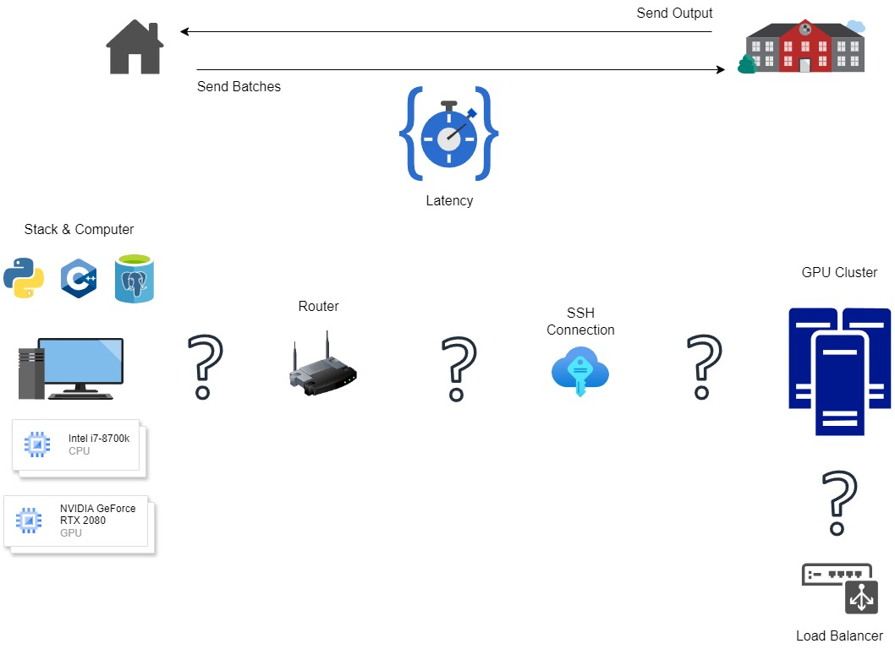

# Computer-to-GPU Cluster for Gaussian Model Data

## Overview
* Brief description of the project and its goals.
* Target audience and intended use.

## Cluster Setup
* Hardware specifications (number of nodes, GPUs per node, CPU, memory).
* Software stack (operating system, deep learning framework, cluster management tool).
* Network configuration (topology, bandwidth).

## Data
* Data format (CSV, Parquet, etc.) and schema.
* Data preprocessing steps (cleaning, normalization, feature engineering).
* Data location (local storage, distributed file system).

## Data Transfer
* Method for transferring data to the cluster (SSH, NFS, HDFS).
* Data partitioning and distribution strategy.

## GPU Utilization
* How GPUs are used (training, inference).
* Deep learning framework and libraries.
* Code structure for GPU computations.

## Code Structure
* Overview of code organization.
* Description of key modules and functions.
* Dependencies and installation instructions.

## Usage
* Step-by-step instructions for users.
* Example commands or scripts.

## Troubleshooting
* Common issues and solutions.

## Additional Notes
* There are some specific considerations needed to achieve the goals of this project. Here is a visualization

The question marks represent the connections needed to send and receive data for this application. 

## Contact
* Information for contacting the project team.
